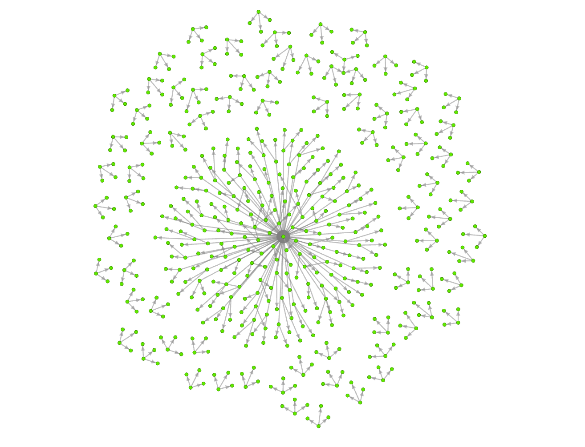

# Software Dependency Dataset Analaysis
a python script to analyze and visualize software dependency relationships from a raw private dataset 

#### Form of Dataset 
Column names from left to right: d_r_uuid, d1, d2, d3, version, license_id

d_r_uuid is the id of each software.
Both version and license_id contain only a single value, so when a software has more than one version or license, the entire row is duplicated with the version/license_id replaced. Besides, there might be a lot of entirely identical rows.  

#### Dependencies
- python 3.6
- pandas 0.20.3
- networkx 1.11 
- Gephi 0.9.1 (to view/style the graph produced) 

#### Sample Ouput Graph in Gephi

 